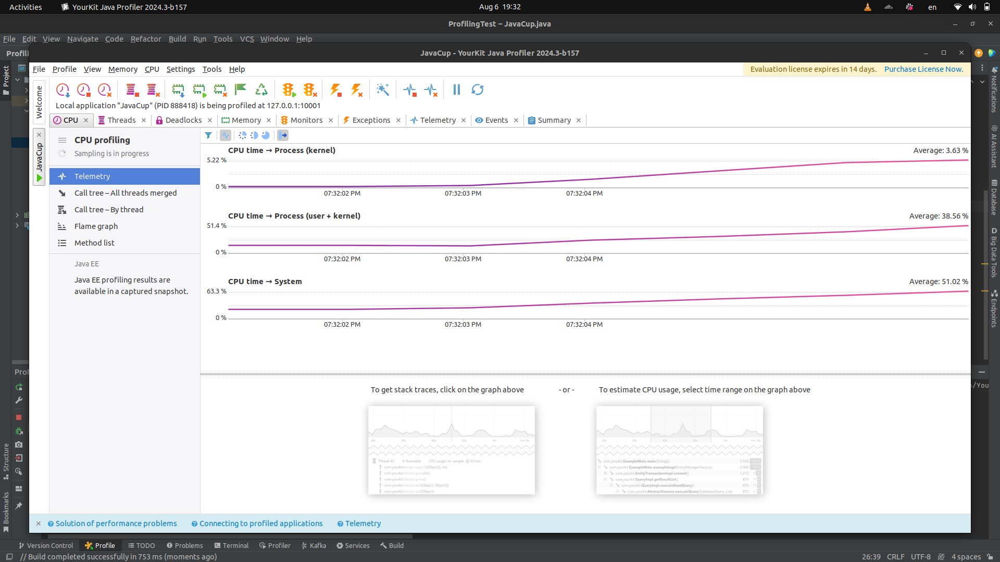
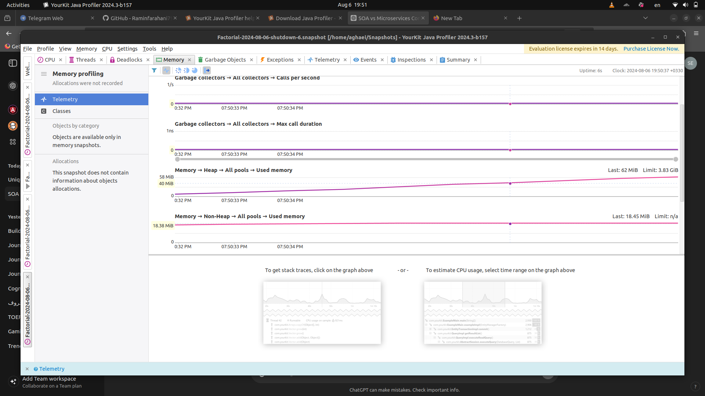

# SE-Lab4

## تبدیل نیازمندی ها به موارد آزمون با استفاده از روش ایجاد مبتنی بر رفتار(BDD)
### بخش ۱:
تست دوم (که عدد منفی دارد) به مشکل undefined می‌خورد. به این دلیل که وقتی scenario outline داریم، cucumber رشته‌های داخل جدول را به جای پارامتر‌هایی که در تعریف گام‌ها (given when then) مشخص کرده‌ایم قرار می‌دهد. از طرف دیگر، در پیاده‌سازی کد گام‌ها، با استفاده از annotation‌های @given  @when @then، این رشته‌ها دریافت می‌شوند و با رجکسی که در آن‌ها قرار دارد مطابقت داده می‌شوند تا پارامتر‌های تابع از آن استخراج شود. ولی در رجکسی که در گام اول مشخص شده است، عدد منفی پیش‌بینی نشده است. در نتیجه رشته‌های این گام با هیچ کدام از توابع given انطباق ندارند و به مشکل می‌خوریم. برای حل این مشکل، رجکس را باید طوری تغییر دهیم که عدد منفی را هم قبول کند. در رشته‌ی زیر این تغییر را انجام داده‌ایم:

    @Given("^Two input values, (-?\\d+) and (-?\\d+)$")
    
حال دوباره تست‌ها را اجرا می‌کنیم:


### بخش ۲:

برای این بخش، از ما خواسته شده است که یک فیچر را پیاده کنیم.
اما با توجه به این که جمع کردن دو عدد را یک فیچر درنظر گرفته‌ایم،
باید تقسیم و جذر را هم فیچر در نظر بگیریم و نمی‌توانیم فیچر را به صورت یکجا پیاده‌سازی کنیم.

برای این کار در BDD، ابتدا باید سناریو‌های مد نظرمان را بنویسیم و گام‌های آن را پیاده‌سازی کنیم.
از آن‌جایی که تقسیم و جذر را پیاده‌سازی نکردم‌ایم، این کار به خطای کامپایل منجر می‌شود. 
پس این توابع را به calculator اضافه می‌کنیم ولی داخل آن‌ها را خالی می‌گذاریم.


حال با اجرا کردن تست‌ها، به ارور می‌خوریم. چون تقسیم و جذر به درستی کار خود را انجام نمی‌دهند.
پس به ترتیب سراغ آن‌ها می‌رویم و سناریو‌های آن‌ها و پیاده‌سازی آن‌ها را اضافه می‌کنیم.

ابتدا برای تقسیم، سناریو‌ها را می‌نویسیم. سپس پیاده‌سازی گام‌ها را انجام می‌دهیم.
(برای تقسیم، یک گام اضافه شده است که تقسیم دو عدد را انجام می‌دهد.).
و در نهایت، پیاده ‌سازی تابع تقسیم را انجام می‌دهیم.


سپس این کار را برای جذر انجام می‌دهیم. در جذر دو گام به گام‌هایمان اضافه می‌شود.
شایان ذکر است که وقتی که تست‌های جذر پاس شوند، تست‌های سناریو‌ی خواسته شده هم همزمان با آن پاس می‌شوند.
این یعنی فیچر ما به طور کامل پیاده‌سازی شده است.


<div dir="rtl">

### بخش ۳: - Profiling
ابتدا برنامه مورد نظر را مطابق ویدیو آموزش اجرا می‌کنیم. 

طیق عکس زیر مشخص است که تابع temp() بیشترین زمان اجرا را از cpu گرفته است.





دلیل مصرف زیاد زمان در این تابع این است که حافظه را از پیش نگرفته و در هربار افزودن باید آن را مجدد بگیرد.

کد را به صورت زیر تغییر می دهیم و مموری مورد نیاز را از همان ابتدا در یک آرایه می‌گیریم.

<div dir="ltr">

```java
public static void temp() {
        int[] b = new int[10000 * 20000];
        for (int i = 0; i < 10000; i++)
        {
            int r = i * 10000;
            for (int j = 0; j < 20000; j++) {
                b[r + j] = i + j;
            }
        }
    }
```

<div dir="rtl">


مشاهده می‌شود که زمان اجرا تابع تقریبا ۹۰ درصد کاهش پیدا کرده است.


همچنین مصرف cpu نیز مخصوصا در کرنل کاهش پیدا کرده است چون برخلاف حالت قبلی دیگر نیاز به درخواست مموری مجدد در زمان اجرا برنامه نیست.


کاهش شدید مموری نیز کاملا مشخص است چون مموری از ابتدا فیکس است.


### بخش ۳ - پارت دوم
ابتدا قطعه کد زیر را برای محاسبه فاکتوریل می‌نویسیم.

<div dir="ltr">

````java
public class Factorial {

    public static void main(String[] args) {
        int number = 20;
        System.out.println("Factorial of " + number + " is: " + factorial(number));
    }

    public static long factorial(int n) {
        if (n == 0) {
            return 1;
        } else {
            return n * factorial(n - 1);
        }
    }
}

````
<div dir="rtl">


مموری و cpu مصرفی به صورت زیر است.




حالا ورژن بهینه آن را بدون بازگشتی پیاده‌سازی می‌کنیم.

<div dir="ltr">


```java
public class Factorial {

    public static void main(String[] args) {
        int number = 20;
        System.out.println("Factorial of " + number + " is: " + factorial(number));
    }

    public static long factorial(int n) {
        long result = 1;
        for (int i = 1; i <= n; i++) {
            result *= i;
        }
        return result;
    }
}

```

<div dir="rtl">

نتیجه را در ۲ عکس زیر می‌بینیم.


می‌بینیم که cpu تقریبا تغییری نداشته اما مموری به شدت کاهش یافته‌است چون توابع بازگشتی بخاطر ذخیره حالت تابع، مموری زیادی مصرف می کنند.

